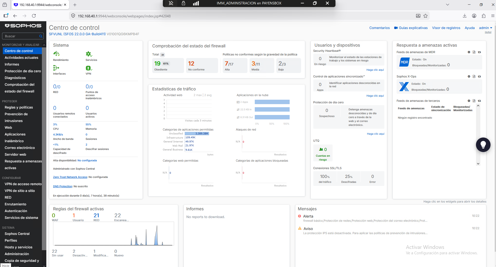
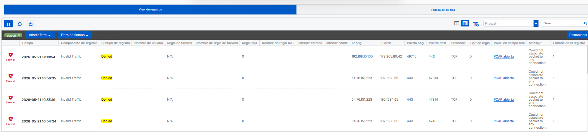
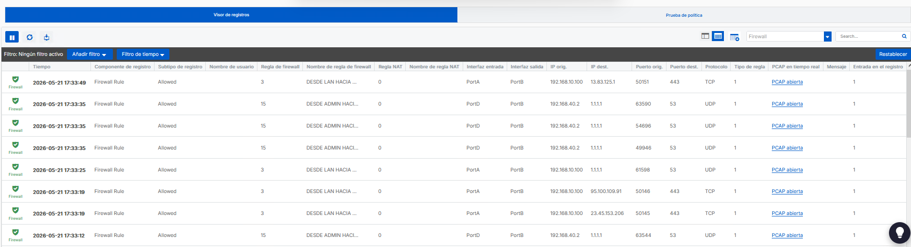
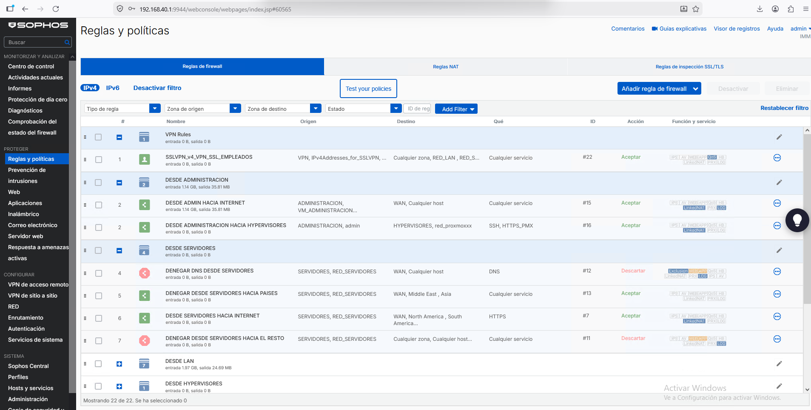
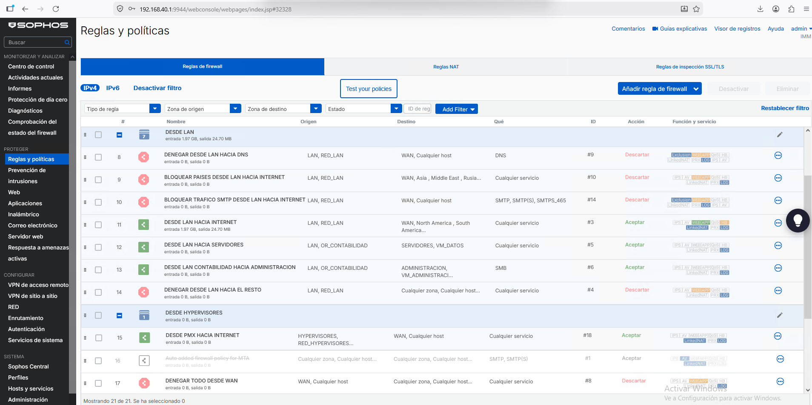

# 🔐 Secure Network Architecture & Sophos NGFW Deployment
### Terra Renewables — Enterprise Cybersecurity Lab

> **Lab environment** built on Hyper-V that emulates a production enterprise network. Designed to demonstrate applied knowledge of network segmentation, perimeter hardening, and defence-in-depth principles.

---

## 📌 Project Overview

This project documents the design and deployment of a **Next-Generation Firewall (NGFW)** using **Sophos XG** as the security perimeter for a simulated organisation called *Terra Renewables*. The architecture follows two core security principles:

- **Defence in Depth** — multiple independent security layers so that the failure of one control does not compromise the entire environment.
- **Principle of Least Privilege** — every zone, user, and service is granted only the minimum access required to function.

The goal was to build a realistic enterprise security baseline from scratch: from IP addressing and VLAN design to traffic filtering policies, administrative hardening, and endpoint telemetry integration.

---

## 🏗️ Lab Environment

| Component | Details |
|---|---|
| **Hypervisor** | Microsoft Hyper-V |
| **NGFW** | Sophos XG Firewall (VM) |
| **Network model** | Multi-zone segmentation via logical interfaces |
| **Licence tier** | Free/Home licence (limitations noted where relevant) |

The Sophos XG VM acts as the **default gateway** for all segments, centralising NAT, inter-VLAN routing, and security policy enforcement in a single inspection point.

---

## 🗺️ Network Segmentation Design

Each interface maps to an isolated security zone. The rationale for each zone boundary is explained below.

| Interface | Zone | Subnet Gateway | Purpose | Trust Level |
|---|---|---|---|---|
| PortA | LAN | `192.168.10.1` | Corporate users and workstations | Medium |
| PortC | SERVERS | `192.168.30.1` | Domain controllers and critical data | High (restricted) |
| PortD | MANAGEMENT | `192.168.40.1` | Firewall and IT administration | Maximum |
| PortE | HYPERVISORS | `192.168.50.1` | Proxmox VE virtualisation layer | High (restricted) |
| GuestAP | WiFi | `10.255.0.1` | Guest internet access | Untrusted |

### Why this segmentation matters

The main threat this topology mitigates is **lateral movement**: if a workstation in the LAN zone is compromised (e.g. via phishing), the attacker cannot reach the domain controllers in the SERVERS zone or pivot to the management plane, because the firewall enforces explicit deny rules between zones by default.

```
Internet
    │
 [Sophos XG]  ← single choke point for all inter-zone traffic
    ├── LAN          (users)
    ├── SERVERS      (AD, databases)
    ├── MANAGEMENT   (admin-only access)
    ├── HYPERVISORS  (virtualisation)
    └── WiFi         (untrusted guests)
```

---

## 🛡️ Traffic Engineering & Firewall Policy

The ruleset is built on a **Default Deny** posture: all traffic is dropped unless a rule explicitly permits it. Rules are ordered from most restrictive to least.

### LAN Zone
- DNS queries are forced through internal resolvers only → prevents **DNS tunnelling** exfiltration.
- Outbound SMTP is blocked at the perimeter → mitigates the risk of a compromised endpoint being used as a **spam relay** or exfiltration channel.
- Micro-segmentation rules block LAN → MANAGEMENT traffic → users cannot reach the administrative interface even from inside the corporate network.

### SERVERS Zone
- Strict egress filtering: the only permitted outbound traffic is to vendor update servers (allowlisted by destination).
- No inbound connections from LAN or WiFi zones are permitted → this prevents a compromised user workstation from initiating connections to domain controllers.
- *Security reasoning: servers should never initiate contact with lower-trust zones; all legitimate flows are inbound from known sources.*

### HYPERVISORS Zone
- Egress limited to OS/hypervisor patch sources only.
- All internal traffic blocked → the Proxmox management interface is not reachable from user or server segments.

### MANAGEMENT Zone
- Full access to all internal zones for administrative operations.
- **Access to this zone is itself restricted** — see hardening section below.

### WiFi Zone
- Internet access permitted via NAT only.
- All access to internal segments (LAN, SERVERS, MANAGEMENT, HYPERVISORS) is blocked unconditionally → guests are treated as hostile by design.

---

## ⚙️ Advanced Configuration & Hardening

### Secure DNS Resolution
Upstream resolvers configured as **Quad9** (`9.9.9.9`) and **Cloudflare** (`1.1.1.1`). Both providers offer DNS-layer threat intelligence (malicious domain blocking) at no cost, adding a first-hop filter against C2 callbacks and phishing domains.

### Web Filtering & HTTPS Inspection
**SSL/TLS Deep Inspection** is enabled to inspect encrypted traffic — without this, HTTPS tunnels bypass content filtering entirely.

**File Protection** rules block high-risk extensions at the gateway:
- `.ps1` (PowerShell scripts — common malware delivery vector)
- `.iso` (disk images — used to bypass Mark-of-the-Web protections in Windows)
- `.exe`, macro-enabled Office formats

*Note: HTTPS inspection introduces a trust dependency (the Sophos CA must be pushed to endpoints). In this lab, this is handled via GPO in the domain.*

### Sophos Security Heartbeat
Security Heartbeat establishes a **telemetry channel** between the firewall and managed endpoints (via Sophos Central). When an endpoint's health status turns **Red** (active threat detected), the firewall automatically:
1. Quarantines the device by blocking its lateral movement to other zones.
2. Maintains internet access only for remediation (optional, configurable).

This is an example of **automated threat response** — reducing mean time to contain (MTTC) without requiring manual intervention.

### VPN SSL Configuration
A base SSL VPN policy was implemented. The intended cipher suite was **AES-256-GCM** with forward secrecy. *The free home licence restricts some VPN features; this is documented as a known limitation of the lab environment rather than a design compromise.*

### Management Plane Hardening (Principle of Least Privilege applied to the firewall itself)

| Access Method | LAN | SERVERS | HYPERVISORS | WiFi | MANAGEMENT |
|---|:---:|:---:|:---:|:---:|:---:|
| HTTPS (admin UI) | ✗ | ✗ | ✗ | ✗ | ✅ |
| SSH | ✗ | ✗ | ✗ | ✗ | ✅ |

The firewall's own management interface is accessible **only from the MANAGEMENT zone** (`PortD`). This prevents a scenario where an attacker who compromises a user workstation can then access the firewall's admin panel from the same segment.

---

## 📐 Architecture Diagram

```
                        ┌─────────────────────────────────┐
                        │         SOPHOS XG NGFW           │
                        │   (Default Gateway / IPS / WAF)  │
                        └──────────────┬──────────────────┘
                                       │
           ┌───────────┬───────────────┼───────────────┬───────────┐
           │           │               │               │           │
      ┌────▼────┐ ┌────▼────┐   ┌─────▼────┐   ┌─────▼────┐ ┌────▼────┐
      │   LAN   │ │SERVERS  │   │MANAGEMENT│   │HYPERVISORS│ │  WiFi   │
      │.10.0/24 │ │.30.0/24 │   │ .40.0/24 │   │ .50.0/24  │ │10.255/24│
      │         │ │         │   │          │   │           │ │         │
      │ Users   │ │  AD DC  │   │ IT Admins│   │ Proxmox   │ │ Guests  │
      │ Devices │ │  Data   │   │ FW Mgmt  │   │    VMs    │ │(untrust)│
      └─────────┘ └─────────┘   └──────────┘   └───────────┘ └─────────┘

      [Medium]    [Restricted]   [Maximum]      [Restricted]  [Untrusted]
```

---

## 💡 Design Decisions & Trade-offs

| Decision | Rationale | Trade-off |
|---|---|---|
| Single NGFW as choke point | Simplifies policy management; all inter-zone traffic is inspectable | Single point of failure (in production: HA pair) |
| MANAGEMENT zone on dedicated port | Physical/logical separation prevents admin access from user VLANs | Requires dedicated NIC or VLAN-capable switch |
| DNS forced to external resolvers | Quad9/Cloudflare provide threat intelligence filtering | Dependency on third-party resolver uptime |
| HTTPS inspection enabled | Blind spot elimination for encrypted C2/exfiltration | Breaks certificate pinning; requires endpoint CA trust |
| Security Heartbeat for auto-isolation | Reduces MTTC without manual intervention | Requires Sophos-managed endpoints (not all MDM-enrolled devices) |

---

## ⚠️ Known Lab Environment Limitations

This section documents features designed into the architecture but not activatable under the free licence, along with how they would be implemented in a real production environment.

| Feature | Status | Limitation | Production Implementation |
|---|:---:|---|---|
| **IPS (Intrusion Prevention System)** | ⚙️ Designed | Requires **Network Protection** subscription | Custom policy with Drop on High/Critical severity, Alert on Medium, applied to LAN and SERVERS zones |
| **VPN SSL — AES-256-GCM** | ⚙️ Partial | Some cipher options restricted under free licence | Full AES-256-GCM suite with Perfect Forward Secrecy (PFS) enabled |

> **Note on IPS:** Firewall rules are structured to receive IPS policies without modification — the architecture contemplates their integration from the design stage. In production, a ruleset based on a cloned `generalpolicy` would be applied and tuned per zone, prioritising exploit detection, port scan detection, and C2 traffic signatures.

---

## 🚀 Deployment & Replication

The full configuration backup is available in the `/backup` directory of this repository.

### Restore Instructions

1. In the Sophos admin panel, navigate to **Backup & firmware → Restore**.
2. Click **Browse** and select `TerraRenewables_Sophos_Core.backup`.
3. The backup is **AES-encrypted**. To obtain the decryption passphrase, contact me via GitHub or email.
4. Click **Upload and restore**. The system will apply the configuration and reboot.

### Selective Import
Individual rule sets or ACL configurations can be exported/imported via the **Import/Export** tab in the same menu — useful for migrating specific policies to another Sophos instance.

---

## 📚 Key Concepts Demonstrated

- **Network segmentation & micro-segmentation** using security zones
- **Default Deny** firewall policy architecture
- **Lateral movement prevention** via inter-zone ACLs
- **DNS security** (forced internal resolution, anti-tunnelling)
- **SSL/TLS inspection** and encrypted traffic analysis
- **Automated incident response** via Security Heartbeat telemetry
- **Management plane hardening** and principle of least privilege
- **Threat surface reduction** via egress filtering and file type blocking

---

## 📊 Operational Evidence


*Unified view of the NGFW status, interface traffic, and active policies. This confirms the lab environment's operational status and the real-time traffic flow across segmented zones.*

### 🚫 Security Monitoring (Log Viewer: Deny)

*Evidence of the **Default Deny** policy enforcement. The firewall proactively drops unauthorized packets and invalid traffic attempts.*

### ✅ Traffic Flow Validation (Log Viewer: Allow)

*Validation of production firewall rules. Demonstrates traffic permitted from `LAN` (PortA) and `ADMIN` (PortD) zones toward the WAN (PortB) via defined custom policies.*

### 🛡️ Firewall Rule Hierarchy



*The firewall utilizes a top-down processing logic. The rulebase is structured to prioritize trust and management access:*

* **VPN Rules:** Positioned at the top to ensure encrypted tunnels are processed with priority.
* **Administrative & Server Rules:** Critical infrastructure traffic is placed above user segments to ensure low-latency and secure management access.
* **LAN & Hypervisor Rules:** Standardized corporate traffic follows, segmented by VLAN.
* **Guest Zones:** Positioned lower in the hierarchy due to their 'untrusted' status.
* **Default Deny (Drop All):** The final rule, ensuring that any traffic not explicitly permitted is silently dropped, fulfilling the *Default Deny* architectural requirement.

## 🎓 Context

This project was developed as part of a **Master's degree in Cybersecurity**, with the objective of applying theoretical security principles to a practical, lab-based infrastructure. The configuration is designed to be auditable and reproducible, serving both as a learning artefact and a portfolio demonstration of applied network security skills.

---

## 📬 Contact

Questions about the architecture, restore passphrase, or implementation details → open an issue or reach out via the contact information on my GitHub profile.
