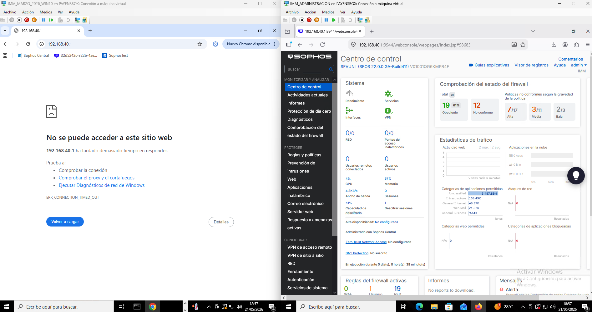
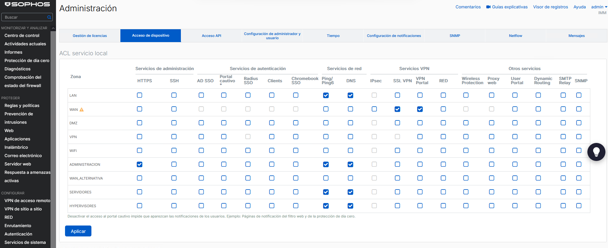

# 🔐 Sophos NGFW Deployment and Secure Network Architecture

## 📌 Project Description

This project documents the design and deployment of a **Next-Generation Firewall (NGFW)** with **Sophos XG** as the security perimeter of a simulated organization.

> **Lab environment** built on Hyper-V emulating a real corporate network infrastructure. Designed to demonstrate the practical application of network segmentation, perimeter hardening, and defense in depth.

The architecture is built on two security principles:

- **Defense in Depth** — multiple independent security layers, so that the failure of one control does not compromise the entire environment.
- **Principle of Least Privilege** — each zone, user, and service has only the access strictly necessary to operate.

The goal was to build an enterprise security baseline from scratch: from IP addressing and VLAN design to traffic filtering policies, administrative hardening, and endpoint telemetry integration.

---

## 🏗️ Lab Environment

| Component | Detail |
|---|---|
| **Hypervisor** | Microsoft Hyper-V |
| **NGFW** | Sophos XG Firewall (VM) |
| **Network model** | Multi-zone segmentation via logical interfaces |
| **License tier** | Free/Home license (limitations noted where applicable) |

The Sophos XG VM acts as the **default gateway** for all segments, centralizing address translation (NAT), inter-VLAN routing, and security policy enforcement at a single inspection point.

---

## 🗺️ Network Segmentation Design

Each interface maps to an isolated security zone. The reasoning behind each zone boundary is detailed below.

| Interface | Zone | Subnet Gateway | Function | Trust Level |
|---|---|---|---|---|
| PortA | LAN | `192.168.10.1` | Corporate users and workstations | Medium |
| PortC | SERVERS | `192.168.30.1` | Domain controllers and critical data | High (restricted) |
| PortD | ADMINISTRATION | `192.168.40.1` | Firewall management and IT team | Maximum |
| PortE | HYPERVISORS | `192.168.50.1` | Proxmox VE virtualization layer | High (restricted) |
| GuestAP | WiFi | `10.255.0.1` | Guest Internet access | Untrusted |

### Why this segmentation matters

The primary threat this topology mitigates is **lateral movement**: if a machine in the LAN zone is compromised, the attacker cannot reach the domain controllers in the SERVERS zone or pivot toward the administration plane, because the firewall enforces explicit deny rules between zones by design.

```
Internet
    │
 [Sophos XG]  ← single choke point for all inter-zone traffic
    ├── LAN           (users)
    ├── SERVERS       (AD, databases)
    ├── ADMINISTRATION (IT-only access)
    ├── HYPERVISORS   (virtualization)
    └── WiFi          (untrusted guests)
```

---

## 🛡️ Firewall Policy Model: Allowlist with Explicit Deny

### Security posture adopted

The ruleset implements an **Allowlist with Explicit Deny per zone** architecture, combining three complementary mechanisms:

1. **Explicit deny rules** with concrete criteria for the highest-risk vectors (DNS tunnelling, outbound SMTP, high-risk countries, unauthorized inter-zone access). These rules generate contextual logs, making it possible to know exactly which flow attempted to cross a zone boundary and why it was blocked.

2. **Minimal allow rules** that permit only the traffic strictly necessary for each zone, with explicitly defined destinations and services.

3. **Perimeter close rule** at the end of the hierarchy (`DENY ALL FROM WAN`, #8) that silently drops any inbound Internet traffic not covered by prior rules.

This model is more precise than a pure Default Deny because explicit deny rules generate **actionable telemetry**: rather than a single generic counter for dropped traffic, each deny rule logs the specific vector that attempted to fire, facilitating threat detection and forensic analysis.

### Top-down processing logic

The firewall evaluates rules from top to bottom, stopping at the first match. The hierarchy is structured to prioritize high-risk explicit denies before permits:

```
[VPN Rules]                    ← encrypted tunnels with highest priority
[ADMINISTRATION Rules]         ← critical infrastructure and management
[SERVERS Rules]                ← traffic to/from restricted zone
[LAN Explicit Denies]          ← risk vector blocking per zone
[LAN Allow Rules]              ← permitted corporate traffic
[HYPERVISORS Rules]            ← virtualization layer
[WiFi Rules]                   ← guests, last due to untrusted status
[DENY ALL FROM WAN]            ← perimeter close rule
```

---

## ⚙️ Traffic Engineering per Zone

### LAN Zone

| Rule | Action | Reasoning |
|---|---|---|
| DENY FROM LAN TO DNS (#9) | Drop | Forces DNS resolution through the firewall's internal resolvers only. Prevents exfiltration via DNS tunnelling. |
| BLOCK COUNTRIES FROM LAN TO INTERNET (#10) | Drop | Active geo-restriction toward high-risk regions (Asia, Middle East, Russia…). Reduces the attack surface by eliminating destinations statistically associated with C2 infrastructure and phishing. |
| BLOCK SMTP TRAFFIC FROM LAN TO INTERNET (#14) | Drop | Prevents a compromised endpoint from acting as a spam relay or exfiltration channel via email. All legitimate mail is routed through the corporate mail server. |
| FROM LAN TO INTERNET (#3) | Accept | Corporate web access permitted toward North America and South America. Prior geo-restriction has already filtered high-risk destinations. |
| FROM LAN TO SERVERS (#5) | Accept | Controlled access from the accounting subnet (OR_CONTABILIDAD) to the SERVERS zone. Structured data traffic destined for VM_DATOS. |
| FROM LAN ACCOUNTING TO ADMINISTRATION (#6) | Accept | Restricted SMB access from OR_CONTABILIDAD to ADMINISTRATION and VM_ADMINISTRATION. The only permitted LAN → ADMINISTRATION flow. |
| DENY FROM LAN TO EVERYTHING ELSE (#4) | Drop | Explicit denial of all LAN traffic toward any zone or host not covered by prior rules. Blocks generic lateral movement. |

### HYPERVISORS Zone

| Rule | Action | Reasoning |
|---|---|---|
| FROM PMX TO INTERNET (#18) | Accept | Egress limited to OS and hypervisor update traffic. The Proxmox management interface is not reachable from user or server segments. |

### WAN Zone (Perimeter Close)

| Rule | Action | Reasoning |
|---|---|---|
| DENY ALL FROM WAN (#8) | Drop | Close rule. Silently drops any inbound Internet traffic not explicitly authorized by prior rules. |

### WiFi Zone
- Internet access permitted via NAT only.
- All access to internal segments (LAN, SERVERS, ADMINISTRATION, HYPERVISORS) blocked unconditionally → guests are treated as hostile by design.

### ADMINISTRATION Zone
- Full access to all internal zones for administrative operations.
- **Access to this zone itself is restricted** — see hardening section below.

---

## ⚙️ Advanced Configuration and Hardening

### Secure DNS Resolution
External resolvers configured as **Quad9** (`9.9.9.9`) and **Cloudflare** (`1.1.1.1`). Both providers offer DNS-level threat intelligence (malicious domain blocking) at no additional cost, adding a first-hop filter against C2 callbacks and phishing domains.

Rule #9 forces all DNS resolution from the LAN zone through the firewall's internal resolvers, eliminating the possibility of using alternative resolvers to bypass filtering or establish DNS tunnels.

### Web Filtering and HTTPS Inspection
**Deep SSL/TLS Inspection** is enabled to inspect encrypted traffic — without it, HTTPS tunnels completely bypass content filtering.

**File Protection** rules block high-risk extensions at the gateway:
- `.ps1` (PowerShell scripts — common malware delivery vector)
- `.iso` (disk images — used to bypass Windows Mark-of-the-Web protections)
- `.exe`, macro-enabled Office formats

*Note: HTTPS inspection introduces a trust dependency (the Sophos CA must be distributed to endpoints). In this lab, this is managed via GPO on the domain.*

### Sophos Security Heartbeat
Security Heartbeat establishes a **telemetry channel** between the firewall and managed endpoints (via Sophos Central). When an endpoint's health status changes to **Red** (active threat detected), the firewall automatically:
1. Quarantines the device by blocking its lateral movement to other zones.
2. Optionally maintains Internet-only access for remediation (configurable).

This is an example of **automated incident response** — reducing Mean Time to Contain (MTTC) without manual intervention.

### SSL VPN Configuration
A base SSL VPN policy was implemented. The intended cipher suite was **AES-256-GCM** with Perfect Forward Secrecy. *The free license restricts some VPN options; this is documented as a known lab environment limitation, not a design trade-off.*

### Management Plane Hardening (Least Privilege applied to the firewall itself)

| Access Method | LAN | SERVERS | HYPERVISORS | WiFi | ADMINISTRATION |
|---|:---:|:---:|:---:|:---:|:---:|
| HTTPS (admin panel) | ✗ | ✗ | ✗ | ✗ | ✅ |
| SSH | ✗ | ✗ | ✗ | ✗ | ✅ |

The firewall's management interface is accessible **only from the ADMINISTRATION zone** (`PortD`). This prevents the scenario where an attacker who compromises a user workstation can reach the firewall's admin panel from that same segment.

---

## 📐 Architecture Diagram

```
                        ┌─────────────────────────────────┐
                        │         SOPHOS XG NGFW           │
                        │  (Default Gateway / IPS / WAF)   │
                        └──────────────┬──────────────────┘
                                       │
           ┌───────────┬───────────────┼───────────────┬───────────┐
           │           │               │               │           │
      ┌────▼────┐ ┌────▼────┐   ┌─────▼────┐   ┌─────▼────┐ ┌────▼────┐
      │   LAN   │ │SERVERS  │   │  ADMIN   │   │HYPERVISOR │ │  WiFi   │
      │.10.0/24 │ │.30.0/24 │   │ .40.0/24 │   │ .50.0/24  │ │10.255/24│
      │         │ │         │   │          │   │           │ │         │
      │  Users  │ │  AD DC  │   │ IT Admins│   │ Proxmox   │ │ Guests  │
      │Workstats│ │  Data   │   │ FW Mgmt  │   │   VMs     │ │(hostile)│
      └─────────┘ └─────────┘   └──────────┘   └───────────┘ └─────────┘

      [Medium]    [Restricted]   [Maximum]      [Restricted]  [Untrusted]
```

---

## 💡 Design Decisions and Trade-offs

| Decision | Reasoning | Trade-off |
|---|---|---|
| Allowlist with Explicit Deny per zone | Explicit denies generate per-vector actionable logs; WAN close rule eliminates uncovered traffic | Requires more granular rule design than a pure Default Deny |
| Single NGFW as choke point | Simplifies policy management; all inter-zone traffic is inspectable | Single point of failure (production: HA pair) |
| ADMINISTRATION zone on dedicated port | Physical/logical separation prevents admin access from user VLANs | Requires dedicated NIC or VLAN-capable switch |
| Active geo-restriction on LAN zone | Reduces attack surface by eliminating statistically high-risk destinations | May block legitimate traffic to restricted regions; requires exception list |
| DNS forced to internal resolvers + Quad9/Cloudflare | Eliminates DNS tunnelling vector and adds threat intelligence filtering | Dependency on third-party resolver uptime |
| HTTPS inspection enabled | Eliminates the blind spot of encrypted C2/exfiltration traffic | Breaks certificate pinning; requires endpoint trust in the Sophos CA |
| Security Heartbeat for automatic isolation | Reduces MTTC without manual intervention | Requires Sophos-managed endpoints (not all MDM devices) |

---

## ⚠️ Known Lab Environment Limitations

This section documents features designed into the architecture but not activatable under the free license, along with how they would be implemented in a real production environment.

| Feature | Status | Limitation | Production Implementation |
|---|---|---|---|
| **IPS (Intrusion Prevention System)** | ⚙️ Designed | Requires **Network Protection** subscription | Custom policy with Drop on High/Critical severity, Alert on Medium, applied across LAN and SERVERS zones |
| **SSL VPN — AES-256-GCM** | ⚙️ Partial | Some cipher options restricted under free license | Full AES-256-GCM suite with Perfect Forward Secrecy (PFS) enabled |

> **Note on IPS:** Firewall rules are structured to receive IPS policies without modification — the architecture contemplates their integration from the design stage. In production, a ruleset based on a cloned and tuned `generalpolicy` would be applied per zone, prioritizing exploit detection, port scans, and C2 traffic.

---

## 🔬 Validation and Threat Simulation

This section documents the tests performed to verify that security policies work correctly in practice, not just in configuration.

### Test 1 — Lateral Movement Simulation: LAN → ADMINISTRATION

**Simulated scenario:** An attacker compromises a user endpoint in the LAN zone (`WIN10`, `192.168.10.100`, interface BOCA1_10) and attempts to access the firewall's admin panel (`192.168.40.1`) to escalate privileges or modify rules. This is one of the most common attack vectors in corporate networks following an initial intrusion.

**Expected result:** Full block. The `DENY FROM LAN TO EVERYTHING ELSE` rule (#4) must prevent any access from user segments to the management plane.

**Obtained result:** ✅ Access blocked.



*The image shows both machines side by side: on the left, the WIN10 endpoint (LAN zone) receives `ERR_CONNECTION_TIMED_OUT` when attempting to reach `192.168.40.1`. On the right, the Administration VM successfully accesses the Sophos panel at the same address. Same destination IP. Two zones. Two results — direct validation of the least privilege principle and microsegmentation.*

**Conclusion:** The zone architecture prevents an attacker with access to the user network from reaching the firewall's management plane, eliminating one of the most critical privilege escalation vectors in a corporate network.

---

## 📊 Operational Evidence

### 🖥️ Control Center (Main Dashboard)

*Unified view of NGFW status, per-interface traffic, and active policy summary. Confirms environment operability and traffic flow across segmented zones.*

### 🚫 Security Monitoring (Log Viewer: Deny)

*Evidence of explicit deny policy enforcement per zone. Each log entry identifies the specific blocked vector (DNS, SMTP, geo-restriction, lateral movement).*

### ✅ Flow Monitoring (Log Viewer: Allow)

*Validation of allow rules in production.*

### 🛡️ Firewall Rule Hierarchy


*The firewall uses top-down processing logic, stopping at the first match. The ruleset is structured to prioritize high-risk explicit denies before permits:*

- **VPN Rules:** Positioned first to ensure encrypted tunnels are processed with highest priority.
- **Administration and Servers Rules:** Critical infrastructure traffic sits above user segments.
- **LAN Explicit Denies:** DNS tunnelling, outbound SMTP, geo-restriction, and lateral movement are blocked before evaluating permits.
- **LAN and Hypervisor Allow Rules:** Authorized corporate traffic, segmented by zone and subnet.
- **Guest Zones (WiFi):** Positioned last in the hierarchy due to untrusted status.
- **DENY ALL FROM WAN:** Perimeter close rule that silently drops any unauthorized inbound traffic.

### 🔒 Management Plane Hardening

*Implementation of the least privilege principle on the management plane. Administrative access (HTTPS/SSH) has been restricted exclusively to the `ADMINISTRATION` zone, eliminating the attack surface from unauthorized segments.*

---

## 📚 Key Concepts Demonstrated

- **Network segmentation and microsegmentation** via security zones
- **Allowlist firewall architecture with Explicit Deny per zone**
- **Active geo-restriction** as perimeter attack surface reduction
- **Lateral movement prevention** via explicit inter-zone deny rules
- **DNS security** (forced internal resolution, anti-tunnelling)
- **SSL/TLS inspection** and encrypted traffic analysis
- **Automated incident response** via Security Heartbeat telemetry
- **Management plane hardening** and least privilege principle
- **Attack surface reduction** via egress filtering and file type blocking
- **Active policy validation** via lateral movement simulation

---

## 🚀 Deployment and Replicability

The full configuration backup is available in the `/backup` directory of this repository.

### Restore Instructions

1. In the Sophos admin panel, go to **Backup & firmware → Restore**.
2. Click **Browse** and select the backup file.
3. The backup is **AES-encrypted**. To obtain the decryption password, contact me via GitHub or [LinkedIn](https://www.linkedin.com/in/miguel-reguero/).
4. Click **Upload and restore**. The system will apply the configuration and reboot.

### Selective Import
Individual ruleset or ACL configurations can be exported/imported via the **Import/Export** tab in the same menu — useful for migrating specific policies to another Sophos instance.

---

## 🎓 Context

This project was developed to apply theoretical security principles to a practical lab infrastructure. The configuration is designed to be auditable and reproducible, serving both as a learning artifact and as a demonstration of applied network security skills for my professional portfolio.

---

## 📬 Contact

Questions about the architecture, restore password, or implementation details → open an issue or reach out via [LinkedIn](https://www.linkedin.com/in/miguel-reguero/).
